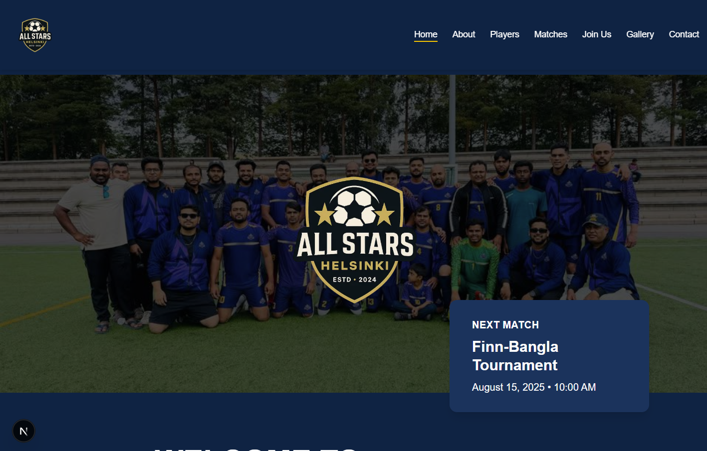
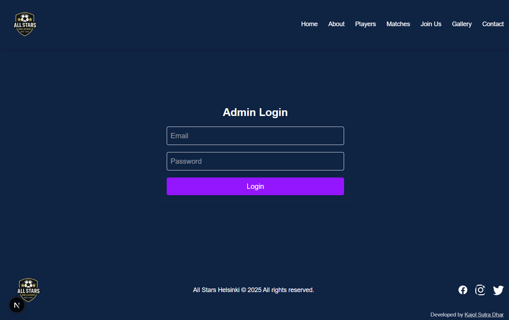
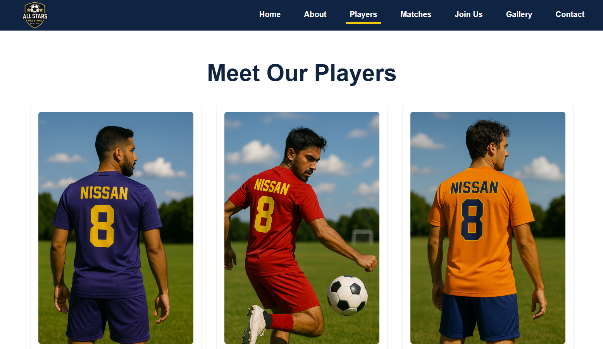
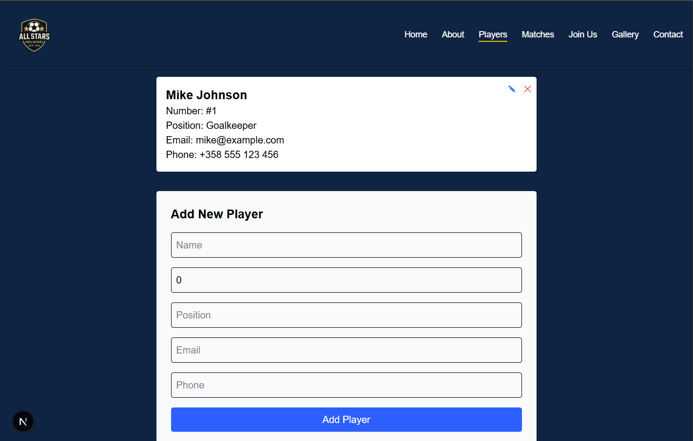
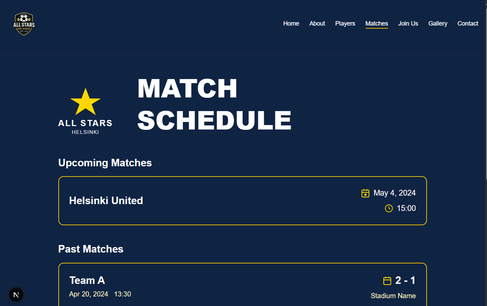
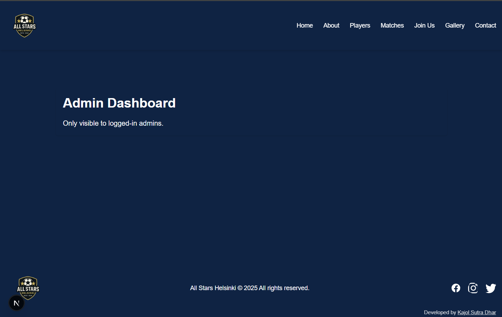
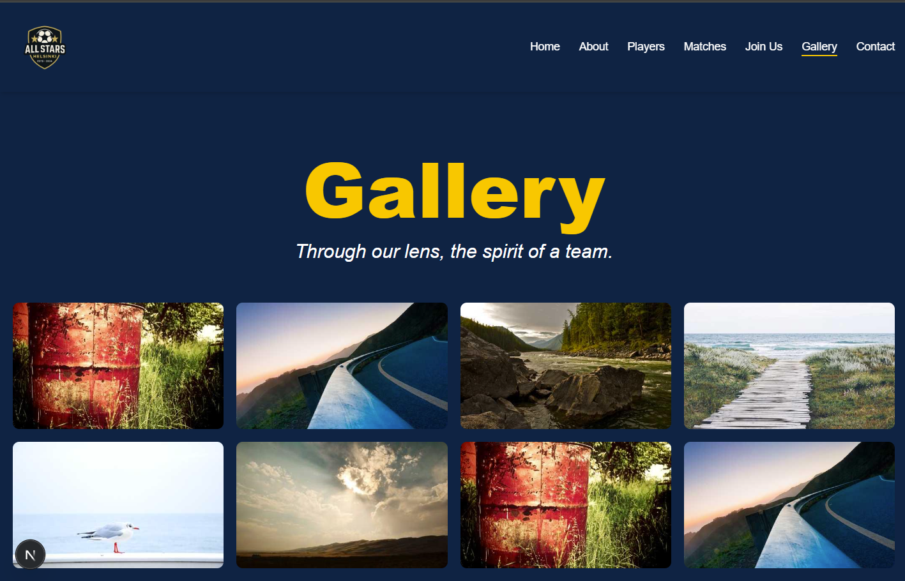
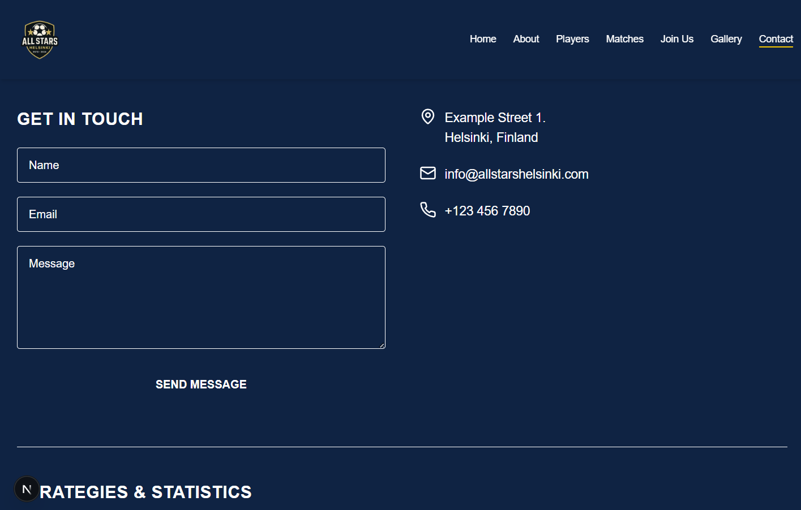

# All Stars Helsinki

A modern web application for managing the All Stars Helsinki sports team. This platform provides an efficient way to manage team operations, player information, and team communications.

## Project Overview

All Stars Helsinki is a comprehensive team management system that helps:

- Track player information and statistics
- Manage team roster and player assignments
- Handle team communications and updates
- Store and organize team-related documents
- Monitor player performance and attendance

## Tech Stack

### Frontend

- **Framework**: Next.js 14 (React)
- **Styling**: Tailwind CSS
- **State Management**: React Hooks
- **Routing**: Next.js App Router
- **UI Components**: Custom components with Tailwind

### Backend

- **Runtime**: Node.js
- **Framework**: Express.js
- **API**: RESTful architecture
- **Authentication**: Firebase Auth
- **Database**: Firebase Firestore
- **File Storage**: Firebase Storage

### Development Tools

- **Package Manager**: npm
- **Version Control**: Git
- **Environment Management**: dotenv
- **API Testing**: Postman/Thunder Client

## Key Features

1. **Player Management**

   - Player profiles with contact information
   - Performance statistics tracking
   - Attendance records
   - Document management

2. **Team Operations**

   - Roster management
   - Team announcements
   - Event scheduling
   - Resource allocation

3. **User Interface**

   - Responsive design
   - Intuitive navigation
   - Real-time updates
   - Mobile-friendly layout

4. **Security**
   - Role-based access control
   - Secure authentication
   - Data encryption
   - Environment variable protection

## Getting Started

### Prerequisites

- Node.js (v18 or higher)
- npm or yarn
- Firebase account and project setup

### Installation

1. Clone the repository

```bash
git clone https://github.com/yourusername/all_stars_helsinki_2.0.git
cd all_stars_helsinki_2.0
```

2. Install dependencies

```bash
# Install backend dependencies
cd backend
npm install

# Install frontend dependencies
cd ../frontend
npm install
```

3. Environment Setup

```bash
# Create environment files
cp .env.example .env.local
```

4. Configure Firebase

   - Add your Firebase configuration to the environment files
   - Set up Firestore database rules
   - Configure Firebase Authentication

5. Run the application

```bash
# Start backend server
cd backend
npm start

# Start frontend development server (in another terminal)
cd frontend
npm run dev
```

## 📸 Screenshots Gallery

<div align="center">
  
### 🏠 **Homepage & Navigation**
<table>
  <tr>
    <td align="center" width="50%">
      
      <br><em>Modern homepage with team branding</em>
    </td>
    <td align="center" width="50%">
      
      <br><em>Secure Firebase authentication</em>
    </td>
  </tr>
</table>

### 👥 **Player & Team Management**

<table>
  <tr>
    <td align="center" width="50%">
      
      <br><em>Player roster with search & filters</em>
    </td>
    <td align="center" width="50%">
      
      <br><em>Add new players with validation</em>
    </td>
  </tr>
</table>

### 🏆 **Matches & Administration**

<table>
  <tr>
    <td align="center" width="50%">
      
      <br><em>Match scheduling & results tracking</em>
    </td>
    <td align="center" width="50%">
      
      <br><em>Administrative panel & oversight</em>
    </td>
  </tr>
</table>

### 📱 **Gallery & Mobile Experience**

<table>
  <tr>
    <td align="center" width="50%">
      
      <br><em>Team photo & media gallery</em>
    </td>
    <td align="center" width="50%">
      
      <br><em>Mobile-optimized responsive design</em>
    </td>
  </tr>
</table>

</div>

## 🚀 Features Highlight

- **🏃‍♂️ Player Management**: Complete player profiles with statistics and performance tracking
- **📅 Match Scheduling**: Organize games, training sessions, and team events
- **📊 Analytics Dashboard**: Visual insights into team performance and player statistics
- **📱 Mobile-First Design**: Optimized for both desktop and mobile devices
- **🔒 Secure Access**: Role-based authentication with Firebase
- **🖼️ Media Gallery**: Team photo and video management
- **📢 Communications**: Team announcements and messaging system
- **⚡ Real-time Updates**: Live data synchronization across all devices

## 🛠️ Development

### Project Structure

```
all_stars_helsinki_2.0/
├── frontend/          # Next.js frontend application
├── backend/           # Express.js backend API
├── design/           # Design documentation and guidelines
│   └── screenshots/  # Application screenshots for documentation
└── README.md        # Project documentation
```

### API Endpoints

- `/api/players` - Player management
- `/api/matches` - Match and schedule handling
- `/api/auth` - Authentication endpoints
- `/api/gallery` - Media management
- `/api/admin` - Administrative functions

## 🤝 Contributing

We welcome contributions to All Stars Helsinki! Please follow these steps:

1. Fork the repository
2. Create a feature branch (`git checkout -b feature/amazing-feature`)
3. Commit your changes (`git commit -m 'Add some amazing feature'`)
4. Push to the branch (`git push origin feature/amazing-feature`)
5. Open a Pull Request

### Code Style

- Follow the existing code style and conventions
- Use TypeScript for type safety
- Write meaningful commit messages
- Add tests for new features

## 📝 License

This project is licensed under the MIT License - see the [LICENSE](LICENSE) file for details.

## 📞 Contact

**All Stars Helsinki Team Management**

- 📧 Email: info@allstarshelsinki.fi
- 🌐 Website: [www.allstarshelsinki.fi](https://www.allstarshelsinki.fi)
- 📱 Phone: +358 XX XXX XXXX

## 🙏 Acknowledgments

- Firebase for providing excellent backend services
- Next.js team for the amazing React framework
- Tailwind CSS for the utility-first CSS framework
- All contributors who help make this project better

---

<div align="center">
  <p>Made with ❤️ for All Stars Helsinki</p>
  <p>© 2025 All Stars Helsinki. All rights reserved.</p>
</div>
